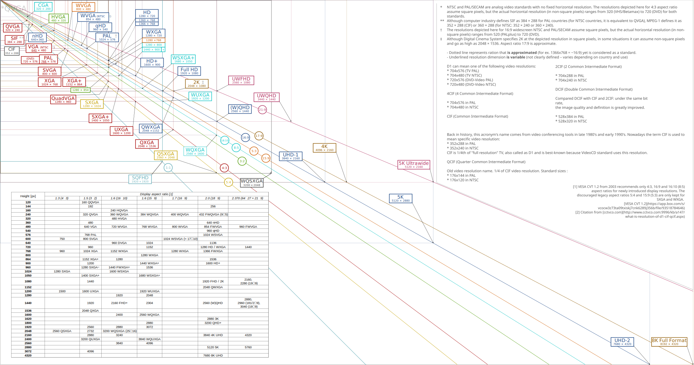

픽셀의 개수를 나타낸다.

|Name|H(px)|V(px)|H:V|H × V(Mpx)|
|---|---|---|---|---|
|[nHD](https://en.wikipedia.org/wiki/Display_resolution_standards#nHD)|640|360|16:9|0.23|
|[qHD](https://en.wikipedia.org/wiki/Display_resolution_standards#qHD)|960|540|16:9|0.518|
|[HD](https://en.wikipedia.org/wiki/Display_resolution_standards#HD)|1280|720|16:9|0.922|
|[HD+](https://en.wikipedia.org/wiki/Display_resolution_standards#HD+)|1600|900|16:9|1.44|
|[FHD](https://en.wikipedia.org/wiki/Display_resolution_standards#FHD)|1920|1080|16:9|2.074|
|[UWFHD](https://en.wikipedia.org/wiki/Display_resolution_standards#UWFHD)|2560|1080|64:27(21:9)|2.765|
|[QHD](https://en.wikipedia.org/wiki/Display_resolution_standards#QHD)|2560|1440|16:9|3.686|
|[UWQHD](https://en.wikipedia.org/wiki/Display_resolution_standards#UWQHD)|3440|1440|43:18(21:9)|4.954|
|[WQHD+](https://en.wikipedia.org/wiki/Display_resolution_standards#WQHD+)|3840|1600|24:10|6.144|
|[QHD+](https://en.wikipedia.org/wiki/Display_resolution_standards#QHD+)|3200|1800|16:9|5.76|
|[SQFHD](https://en.wikipedia.org/wiki/Display_resolution_standards#SQFHD)|1920|1920|1:1|3.686|
|[4K UHD](https://en.wikipedia.org/wiki/Display_resolution_standards#4K_UHD)|3840|2160|16:9|8.294|
|[UHD+](https://en.wikipedia.org/wiki/Display_resolution_standards#UHD+)|5120|2880|16:9|14.746|
|[8K UHD](https://en.wikipedia.org/wiki/Display_resolution_standards#8K_UHD)|7680|4320|16:9|33.178|

[Wikipedia](https://en.wikipedia.org/wiki/Display_resolution_standards)